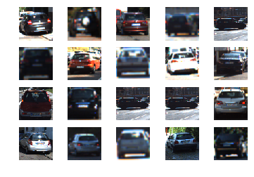
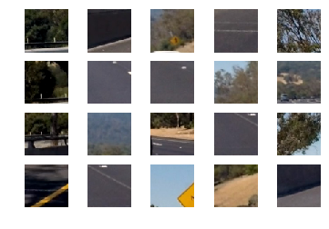
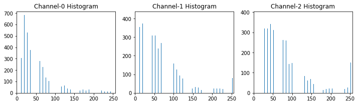
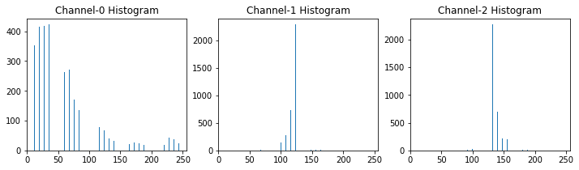
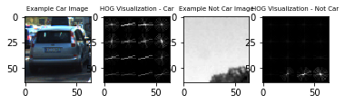
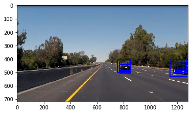
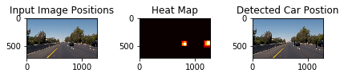

## Vehicle Detection Project

The goals / steps of this project are the following:

* Perform a Histogram of Oriented Gradients (HOG) feature extraction on a labeled training set of images and train a classifier Linear SVM classifier
* Optionally, you can also apply a color transform and append binned color features, as well as histograms of color, to your HOG feature vector.
* Note: for those first two steps don’t forget to normalize your features and randomize a selection for training and testing.
* Implement a sliding-window technique and use your trained classifier to search for vehicles in images.
* Run your pipeline on a video stream (start with the test_video.mp4 and later implement on full project_video.mp4) and create a heat map of recurring detections frame by frame to reject outliers and follow detected vehicles.
* Estimate a bounding box for vehicles detected. 

---


```python
# Import required libraries
from sklearn.preprocessing import StandardScaler
from sklearn.svm import LinearSVC, SVC
from skimage.feature import hog
import matplotlib.image as mpimg
import matplotlib.pyplot as plt
from skimage.feature import hog
import numpy as np
import cv2
import pickle
import glob
import time
```

### Histogram of Oriented Gradients (HOG)

#### 1. Explain how (and identify where in your code) you extracted HOG features from the training images.

The code for this step is contained in get_hog_features() method.

I started by reading in all the vehicle and non-vehicle images. Here is an example of one of each of the vehicle and non-vehicle classes:


```python
# Read in cars dataset
vehicle_images = [glob.glob('../../vehicles/vehicles/KITTI_extracted/*.png')]
vehicle_images.append(glob.glob('../../vehicles/vehicles/GTI_Far/*.png'))
vehicle_images.append(glob.glob('../../vehicles/vehicles/GTI_Left/*.png'))
vehicle_images.append(glob.glob('../../vehicles/vehicles/GTI_MiddleClose/*.png'))
vehicle_images.append(glob.glob('../../vehicles/vehicles/GTI_Right/*.png'))

# Read in not cars dataset
non_vehicle_images = [glob.glob('../../non-vehicles/non-vehicles/Extras/*.png')]
non_vehicle_images.append(glob.glob('../../non-vehicles/non-vehicles/GTI/*.png'))
                      
cars = []
notcars = []

# Append all cars images in cars[]
for images in vehicle_images:
    for each_image in images:
        cars.append(each_image)

# Append all non cars images in notcars[]
for images in non_vehicle_images:
    for each_image in images:
        notcars.append(each_image)
        
print("Cars: " + str(len(cars)))
print("Not Cars: "+ str(len(notcars)))
```

    Cars: 8792
    Not Cars: 8968
    


```python
# Some sample car images
for i in range(5):
    for j in range(4):
        image = plt.imread(cars[4*i + np.random.randint(0, 100)])
        plt.subplot(4,5,4*i + j + 1)
        plt.axis('off')
        plt.imshow(image)
```





```python
# Some sample non-car images
for i in range(5):
    for j in range(4):
        image = plt.imread(notcars[4*i + np.random.randint(0, 2000)])
        plt.subplot(4,5,4*i + j + 1)
        plt.axis('off')
        plt.imshow(image)
```





```python
# Function to return HOG features and visualization
def get_hog_features(img, orient, pix_per_cell, cell_per_block, 
                        vis=False, feature_vec=True):
    # Call with two outputs if vis==True
    if vis == True:
        features, hog_image = hog(img, orientations=orient, 
                                  pixels_per_cell=(pix_per_cell, pix_per_cell),
                                  block_norm= 'L2-Hys',
                                  cells_per_block=(cell_per_block, cell_per_block), 
                                  transform_sqrt=True, 
                                  visualise=vis, feature_vector=feature_vec)
        return features, hog_image
    # Otherwise call with one output
    else:      
        features = hog(img, orientations=orient, 
                       pixels_per_cell=(pix_per_cell, pix_per_cell),
                       cells_per_block=(cell_per_block, cell_per_block), 
                       block_norm= 'L2-Hys',
                       transform_sqrt=True, 
                       visualise=vis, feature_vector=feature_vec)
        return features
```


```python
# Define a function to compute binned color features  
def bin_spatial(img, size=(32, 32)):
    # Use cv2.resize().ravel() to create the feature vector
    features = cv2.resize(img, size).ravel() 
    # Return the feature vector
    return features
```


```python
# Function to compute color histogram features 
def color_hist(img, nbins=32, bins_range=(0, 256), plot_histogram = False):
    img = img*255
    # Compute the histogram of the color channels separately
    channel1_hist = np.histogram(img[:,:,0], bins=nbins, range=bins_range)
    channel2_hist = np.histogram(img[:,:,1], bins=nbins, range=bins_range)
    channel3_hist = np.histogram(img[:,:,2], bins=nbins, range=bins_range)
    # Concatenate the histograms into a single feature vector
    hist_features = np.concatenate((channel1_hist[0], channel2_hist[0], channel3_hist[0]))
    
    if plot_histogram:
        # Generating bin centers
        bin_edges = channel1_hist[1]
        bin_centers = (bin_edges[1:]  + bin_edges[0:len(bin_edges)-1])/2

        # Plot a figure with all three bar charts
        fig = plt.figure(figsize=(12,3))
        plt.subplot(131)
        plt.bar(bin_centers, channel1_hist[0])
        plt.xlim(0, 256)
        plt.title('Channel-0 Histogram')
        plt.subplot(132)
        plt.bar(bin_centers, channel2_hist[0])
        plt.xlim(0, 256)
        plt.title('Channel-1 Histogram')
        plt.subplot(133)
        plt.bar(bin_centers, channel3_hist[0])
        plt.xlim(0, 256)
        plt.title('Channel-2 Histogram')

    # Return the individual histograms, bin_centers and feature vector
    return hist_features
```

I then explored different color spaces and different skimage.hog() parameters (orientations, pixels_per_cell, and cells_per_block). I grabbed random images from each of the two classes and displayed them to get a feel for what the skimage.hog() output looks like.

Here is an example using the RGB/YCrCb color space and HOG parameters of orientations=16, pixels_per_cell=(16, 16) and cells_per_block=(2, 2)


```python
car_test_image = plt.imread(cars[1000])
not_car_test_image = plt.imread(notcars[1000])

# RGB color space
histogram_features = color_hist(car_test_image, plot_histogram = True)
```





```python
# YCrCb color space
car_test_image_yCrCb = cv2.cvtColor(car_test_image, cv2.COLOR_RGB2YCrCb)
histogram_features = color_hist(car_test_image_yCrCb, plot_histogram = True)
```





```python
gray_image_car = cv2.cvtColor(car_test_image, cv2.COLOR_RGB2GRAY)
gray_image_not_car = cv2.cvtColor(not_car_test_image, cv2.COLOR_RGB2GRAY)


features_car, hog_image_car = get_hog_features(gray_image_car, orient=16, 
                        pix_per_cell=16, cell_per_block=2, 
                        vis=True, feature_vec=False)

features_not_car, hog_image_not_car = get_hog_features(gray_image_not_car, orient=16, 
                        pix_per_cell=16, cell_per_block=2, 
                        vis=True, feature_vec=False)

# Plot the examples
fig = plt.figure()
plt.subplot(141)
plt.imshow(car_test_image, cmap='gray')
plt.title('Example Car Image',fontsize=7)
plt.subplot(142)
plt.imshow(hog_image_car, cmap='gray')
plt.title('HOG Visualization - Car',fontsize=7)
plt.subplot(143)
plt.imshow(gray_image_not_car, cmap='gray')
plt.title('Example Not Car Image',fontsize=7)
plt.subplot(144)
plt.imshow(hog_image_not_car, cmap='gray')
plt.title('HOG Visualization - Not Car',fontsize=7)
```


    <matplotlib.text.Text at 0x1b210b42630>





```python
# Define a function to extract features from a list of images
# Have this function call bin_spatial() and color_hist()
def extract_features(imgs, color_space='RGB', spatial_size=(32, 32),
                        hist_bins=32, orient=9, 
                        pix_per_cell=8, cell_per_block=2, hog_channel=0,
                        spatial_feat=True, hist_feat=True, hog_feat=True):
    # Create a list to append feature vectors to
    features = []
    # Iterate through the list of images
    for file in imgs:
        file_features = []
        # Read in each one by one
        image = mpimg.imread(file)
        # apply color conversion if other than 'RGB'
        if color_space != 'RGB':
            if color_space == 'HSV':
                feature_image = cv2.cvtColor(image, cv2.COLOR_RGB2HSV)
            elif color_space == 'LUV':
                feature_image = cv2.cvtColor(image, cv2.COLOR_RGB2LUV)
            elif color_space == 'HLS':
                feature_image = cv2.cvtColor(image, cv2.COLOR_RGB2HLS)
            elif color_space == 'YUV':
                feature_image = cv2.cvtColor(image, cv2.COLOR_RGB2YUV)
            elif color_space == 'YCrCb':
                feature_image = cv2.cvtColor(image, cv2.COLOR_RGB2YCrCb)
        else: feature_image = np.copy(image)      

        if spatial_feat == True:
            spatial_features = bin_spatial(feature_image, size=spatial_size)
            file_features.append(spatial_features)
        if hist_feat == True:
            # Apply color_hist()
            hist_features = color_hist(feature_image, nbins=hist_bins)
            file_features.append(hist_features)
        if hog_feat == True:
        # Call get_hog_features() with vis=False, feature_vec=True
            if hog_channel == 'ALL':
                hog_features = []
                for channel in range(feature_image.shape[2]):
                    hog_features.append(get_hog_features(feature_image[:,:,channel], 
                                        orient, pix_per_cell, cell_per_block, 
                                        vis=False, feature_vec=True))
                hog_features = np.ravel(hog_features)        
            else:
                hog_features = get_hog_features(feature_image[:,:,hog_channel], orient, 
                            pix_per_cell, cell_per_block, vis=False, feature_vec=True)
            # Append the new feature vector to the features list
            file_features.append(hog_features)
        features.append(np.concatenate(file_features))
    # Return list of feature vectors
    return features
```


```python
# Define a function that takes an image,
# start and stop positions in both x and y, 
# window size (x and y dimensions),  
# and overlap fraction (for both x and y)
def slide_window(img, x_start_stop=[None, None], y_start_stop=[None, None], 
                    xy_windows=[(64, 64)], xy_overlap=(0.5, 0.5)):
    # If x and/or y start/stop positions not defined, set to image size
    if x_start_stop[0] == None:
        x_start_stop[0] = 0
    if x_start_stop[1] == None:
        x_start_stop[1] = img.shape[1]
    if y_start_stop[0] == None:
        y_start_stop[0] = 0
    if y_start_stop[1] == None:
        y_start_stop[1] = img.shape[0]
    # Compute the span of the region to be searched    
    xspan = x_start_stop[1] - x_start_stop[0]
    yspan = y_start_stop[1] - y_start_stop[0]
    window_list = []
    for xy_window in xy_windows:
        # Compute the number of pixels per step in x/y
        nx_pix_per_step = np.int(xy_window[0]*(1 - xy_overlap[0]))
        ny_pix_per_step = np.int(xy_window[1]*(1 - xy_overlap[1]))
        # Compute the number of windows in x/y
        nx_buffer = np.int(xy_window[0]*(xy_overlap[0]))
        ny_buffer = np.int(xy_window[1]*(xy_overlap[1]))
        nx_windows = np.int((xspan-nx_buffer)/nx_pix_per_step) 
        ny_windows = np.int((yspan-ny_buffer)/ny_pix_per_step) 
        # Initialize a list to append window positions to
        # Loop through finding x and y window positions
        # Note: you could vectorize this step, but in practice
        # you'll be considering windows one by one with your
        # classifier, so looping makes sense
        for ys in range(ny_windows):
            for xs in range(nx_windows):
                # Calculate window position
                startx = xs*nx_pix_per_step + x_start_stop[0]
                endx = startx + xy_window[0]
                starty = ys*ny_pix_per_step + y_start_stop[0]
                endy = starty + xy_window[1]
                # Append window position to list
                window_list.append(((startx, starty), (endx, endy)))
    # Return the list of windows
    return window_list
```


```python
# Function to draw bounding boxes
def draw_boxes(img, bboxes, color=(0, 0, 255), thick=6):
    # Make a copy of the image
    imcopy = np.copy(img)
    # Iterate through the bounding boxes
    for bbox in bboxes:
        # Draw a rectangle given bbox coordinates
        cv2.rectangle(imcopy, bbox[0], bbox[1], color, thick)
    # Return the image copy with boxes drawn
    return imcopy
```


```python
# NOTE: the next import is only valid for scikit-learn version <= 0.17
# for scikit-learn >= 0.18 use:
# from sklearn.model_selection import train_test_split
from sklearn.cross_validation import train_test_split
```


```python
def single_img_features(img, color_space='RGB', spatial_size=(32, 32),
                        hist_bins=32, orient=9, 
                        pix_per_cell=8, cell_per_block=2, hog_channel=0,
                        spatial_feat=True, hist_feat=True, hog_feat=True):    
    #1) Define an empty list to receive features
    img_features = []
    #2) Apply color conversion if other than 'RGB'
    if color_space != 'RGB':
        if color_space == 'HSV':
            feature_image = cv2.cvtColor(img, cv2.COLOR_RGB2HSV)
        elif color_space == 'LUV':
            feature_image = cv2.cvtColor(img, cv2.COLOR_RGB2LUV)
        elif color_space == 'HLS':
            feature_image = cv2.cvtColor(img, cv2.COLOR_RGB2HLS)
        elif color_space == 'YUV':
            feature_image = cv2.cvtColor(img, cv2.COLOR_RGB2YUV)
        elif color_space == 'YCrCb':
            feature_image = cv2.cvtColor(img, cv2.COLOR_RGB2YCrCb)
    else: feature_image = np.copy(img)      
    #3) Compute spatial features if flag is set
    if spatial_feat == True:
        spatial_features = bin_spatial(feature_image, size=spatial_size)
        #4) Append features to list
        img_features.append(spatial_features)
    #5) Compute histogram features if flag is set
    if hist_feat == True:
        hist_features = color_hist(feature_image, nbins=hist_bins)
        #6) Append features to list
        img_features.append(hist_features)
    #7) Compute HOG features if flag is set
    if hog_feat == True:
        if hog_channel == 'ALL':
            hog_features = []
            for channel in range(feature_image.shape[2]):
                hog_features.extend(get_hog_features(feature_image[:,:,channel], 
                                    orient, pix_per_cell, cell_per_block, 
                                    vis=False, feature_vec=True))      
        else:
            hog_features = get_hog_features(feature_image[:,:,hog_channel], orient, 
                        pix_per_cell, cell_per_block, vis=False, feature_vec=True)
        #8) Append features to list
        img_features.append(hog_features)

    #9) Return concatenated array of features
    return np.concatenate(img_features)
```


```python
# Define a function you will pass an image 
# and the list of windows to be searched (output of slide_windows())
def search_windows(img, windows, clf, scaler, color_space='RGB', 
                    spatial_size=(32, 32), hist_bins=32, 
                    hist_range=(0, 256), orient=9, 
                    pix_per_cell=8, cell_per_block=2, 
                    hog_channel=0, spatial_feat=True, 
                    hist_feat=True, hog_feat=True):

    #1) Create an empty list to receive positive detection windows
    on_windows = []
    #2) Iterate over all windows in the list
    for window in windows:
        #3) Extract the test window from original image
        test_img = cv2.resize(img[window[0][1]:window[1][1], window[0][0]:window[1][0]], (64, 64))      
        #4) Extract features for that window using single_img_features()
        features = single_img_features(test_img, color_space=color_space, 
                            spatial_size=spatial_size, hist_bins=hist_bins, 
                            orient=orient, pix_per_cell=pix_per_cell, 
                            cell_per_block=cell_per_block, 
                            hog_channel=hog_channel, spatial_feat=spatial_feat, 
                            hist_feat=hist_feat, hog_feat=hog_feat)
        #5) Scale extracted features to be fed to classifier
        test_features = scaler.transform(np.array(features).reshape(1, -1))
        #6) Predict using your classifier
        prediction = clf.predict(test_features)
        #7) If positive (prediction == 1) then save the window
        if prediction == 1:
            on_windows.append(window)
    #8) Return windows for positive detections
    return on_windows
```

#### 2. Explain how you settled on your final choice of HOG parameters.

I tried various combinations of parameters to find the maximum accuracy. Below are some of the combinations that I tried.

##### Using: Linear kernel, RGB color_space, 8 orientations, 16 pixels per cell, 2 cells per block, 0 hog_channel and (16,16) spatial size
Feature vector length: 1104

7.38 Seconds to train SVC…

Test Accuracy of SVC = 0.9609

##### Using: Linear kernel, RGB color_space, 8 orientations, 8 pixels per cell, 2 cells per block, 0 hog_channel and (32,32) spatial size
Feature vector length: 4688

22.65 Seconds to train SVC…

Test Accuracy of SVC = 0.9535

##### Using: Linear kernel, RGB color_space, 8 orientations, 8 pixels per cell, 2 cells per block, ALL hog_channel and (24,24) spatial size
Feature vector length: 6480

31.14 Seconds to train SVC…

Test Accuracy of SVC = 0.9617

##### Using: Linear kernel, RGB color_space, 9 orientations, 16 pixels per cell, 1 cells per block, 1 hog_channel and (24,24) spatial size
Feature vector length: 2100

10.93 Seconds to train SVC…

Test Accuracy of SVC = 0.9558

##### Using: Linear kernel, RGB color_space, 9 orientations, 16 pixels per cell, 2 cells per block, ALL hog_channel and (32,32) spatial size
Feature vector length: 4092

20.69 Seconds to train SVC…

Test Accuracy of SVC = 0.9603

##### Using: RBF kernel, YCrCb color_space, 16 orientations, 16 pixels per cell, 2 cells per block, 0 hog_channel and (16,16) spatial size
Feature vector length: 1392

60.3 Seconds to train SVC…

Test Accuracy of SVC = 0.9921

Although RBF kernel took a lot of time to train the SVM but the result was fruitfull. My final accuracy was 99.27%.


```python
color_space = 'YCrCb' # Can be RGB, HSV, LUV, HLS, YUV, YCrCb
orient = 16  # HOG orientations
pix_per_cell = 16 # HOG pixels per cell
cell_per_block = 2 # HOG cells per block
hog_channel = 0 # Can be 0, 1, 2, or "ALL"
spatial_size = (16, 16) # Spatial binning dimensions
hist_bins = 16    # Number of histogram bins
spatial_feat = True # Spatial features on or off
hist_feat = True # Histogram features on or off
hog_feat = True # HOG features on or off
y_start_stop = [405, 650] # Min and max in y to search in slide_window()
```

#### 3. Describe how (and identify where in your code) you trained a classifier using your selected HOG features (and color features if you used them).

To train the SVM first I extracted the features out of cars and not cars images. The code to extract images is present in extract_features method. Then I splitted up the data in to training and validation set. Then I used the training data to train SVM using RBF kernel.


```python
car_features = extract_features(cars, color_space=color_space, 
                        spatial_size=spatial_size, hist_bins=hist_bins, 
                        orient=orient, pix_per_cell=pix_per_cell, 
                        cell_per_block=cell_per_block, 
                        hog_channel=hog_channel, spatial_feat=spatial_feat, 
                        hist_feat=hist_feat, hog_feat=hog_feat)
notcar_features = extract_features(notcars, color_space=color_space, 
                        spatial_size=spatial_size, hist_bins=hist_bins, 
                        orient=orient, pix_per_cell=pix_per_cell, 
                        cell_per_block=cell_per_block, 
                        hog_channel=hog_channel, spatial_feat=spatial_feat, 
                        hist_feat=hist_feat, hog_feat=hog_feat)

# # Create an array stack of feature vectors
X = np.vstack((car_features, notcar_features)).astype(np.float64)

# # # Define the labels vector
y = np.hstack((np.ones(len(car_features)), np.zeros(len(notcar_features))))

# Split up data into randomized training and test sets
rand_state = np.random.randint(0, 100)
X_train, X_test, y_train, y_test = train_test_split(
    X, y, test_size=0.2, random_state=rand_state)

pickle.dump(X_train, open("X_train.sav", 'wb'))
pickle.dump(X_test, open("X_test.sav", 'wb'))
pickle.dump(y_train, open("y_train.sav", 'wb'))
pickle.dump(y_test, open("y_test.sav", 'wb'))
                      
# Fit a per-column scaler
X_scaler = StandardScaler().fit(X_train)

pickle.dump(X_scaler, open("X_scaler.sav", 'wb'))

# Apply the scaler to X
X_train = X_scaler.transform(X_train)
X_test = X_scaler.transform(X_test)

print('Using:',orient,'orientations',pix_per_cell, 'pixels per cell and', cell_per_block,'cells per block')

print('Feature vector length:', len(X_train[0]))

# Use a linear SVC 
svc = SVC(kernel="rbf")
# Check the training time for the SVC
t=time.time()
svc.fit(X_train, y_train)
pickle.dump(svc, open("svc.sav", 'wb'))
t2 = time.time()

print(round(t2-t, 2), 'Seconds to train SVC...')
# Check the score of the SVC
print('Test Accuracy of SVC = ', round(svc.score(X_test, y_test), 4))
# Check the prediction time for a single sample
t=time.time()
```

    Using: 16 orientations 16 pixels per cell and 2 cells per block
    Feature vector length: 1392
    64.79 Seconds to train SVC...
    Test Accuracy of SVC =  0.9921
    

### Sliding Window Search
#### 1. Describe how (and identify where in your code) you implemented a sliding window search. How did you decide what scales to search and how much to overlap windows?

I decied to use 3 sliding windows of size (64, 64), (96,96), and (128,128) on lower half of the image with overlapping of 75% . Since I am using hog features with a threshold of 2, so to make sure the presence of car on a particualr region I slided all three windows on this area.


```python
image = mpimg.imread('../test_images/akhil.jpg')
draw_image = np.copy(image)

# Comment the following line if you extracted training
# data from .jpg images (scaled 0 to 255 by mpimg) and the
# image you are searching is a .jpg (scaled 0 to 255)
# Since the training data was of .png and test data is from jpeg image
# So dividing the pixels by 255
image = image.astype(np.float32)/255

windows = slide_window(image, x_start_stop=[500, None], y_start_stop=y_start_stop, 
                    xy_windows=[(64, 64),(96,96),(128,128)], xy_overlap=(0.7, 0.7))
```

#### 2. Show some examples of test images to demonstrate how your pipeline is working. What did you do to optimize the performance of your classifier?
Ultimately I searched on two scales using YCrCb 1-channel HOG features plus spatially binned color and histograms of color in the feature vector, which provided a nice result. Here is the output of one example images:


```python
hot_windows = search_windows(image, windows, svc, X_scaler, color_space=color_space, 
                        spatial_size=spatial_size, hist_bins=hist_bins, 
                        orient=orient, pix_per_cell=pix_per_cell, 
                        cell_per_block=cell_per_block, 
                        hog_channel=hog_channel, spatial_feat=spatial_feat, 
                        hist_feat=hist_feat, hog_feat=hog_feat)                       

window_img = draw_boxes(draw_image, hot_windows, color=(0, 0, 255), thick=6)
plt.imshow(window_img)
```


    <matplotlib.image.AxesImage at 0x1b267421d68>





#### Video Implementation

##### 1. Describe how (and identify where in your code) you implemented some kind of filter for false positives and some method for combining overlapping bounding boxes.
I recorded the positions of positive detections in each frame of the video. From the positive detections I created a heatmap and then thresholded that map to identify vehicle positions. I then used scipy.ndimage.measurements.label() to identify individual blobs in the heatmap. I then assumed each blob corresponded to a vehicle. I constructed bounding boxes to cover the area of each blob detected.

Here's an example result showing the heatmap from a picture frame of the test video, the result of scipy.ndimage.measurements.label() and the bounding boxes then overlaid on that frame.


```python
from scipy.ndimage.measurements import label

heat = np.zeros_like(image[:,:,0]).astype(np.float)

def add_heat(heatmap, bbox_list):
    # Iterate through list of bboxes
    for box in bbox_list:
        # Add += 1 for all pixels inside each bbox
        # Assuming each "box" takes the form ((x1, y1), (x2, y2))
        heatmap[box[0][1]:box[1][1], box[0][0]:box[1][0]] += 1

    # Return updated heatmap
    return heatmap# Iterate through list of bboxes
    
def apply_threshold(heatmap, threshold):
    # Zero out pixels below the threshold
    heatmap[heatmap <= threshold] = 0
    # Return thresholded map
    return heatmap

def draw_labeled_bboxes(img, labels):
    # Iterate through all detected cars
    for car_number in range(1, labels[1]+1):
        # Find pixels with each car_number label value
        nonzero = (labels[0] == car_number).nonzero()
        # Identify x and y values of those pixels
        nonzeroy = np.array(nonzero[0])
        nonzerox = np.array(nonzero[1])
        # Define a bounding box based on min/max x and y
        bbox = ((np.min(nonzerox), np.min(nonzeroy)), (np.max(nonzerox), np.max(nonzeroy)))
        # Draw the box on the image
        cv2.rectangle(img, bbox[0], bbox[1], (0,0,255), 6)
    # Return the image
    return img

# Add heat to each box in box list
heat = add_heat(heat,hot_windows)
    
# Apply threshold to help remove false positives
# heat = apply_threshold(heat,1)

# Visualize the heatmap when displaying    
heatmap = np.clip(heat, 0, 255)

# Find final boxes from heatmap using label function
labels = label(heatmap)
draw_img = draw_labeled_bboxes(np.copy(image), labels)

# horizontal_stack = np.hstack((np.dstack((heatmap,heatmap,heatmap))*255, draw_img))

fig = plt.figure()
plt.subplot(131)
plt.imshow(image)
plt.title('Input Image Positions')
plt.subplot(132)
plt.imshow(heatmap, cmap='hot')
plt.title('Heat Map')
plt.subplot(133)
plt.imshow(draw_img)
plt.title('Detected Car Postion')
fig.tight_layout()
```





#### 2. Provide a link to your final video output. Your pipeline should perform reasonably well on the entire project video (somewhat wobbly or unstable bounding boxes are ok as long as you are identifying the vehicles most of the time with minimal false positives.)

Below is the code of my pipeline and the final out video


```python
from moviepy.editor import VideoFileClip
from IPython.display import HTML

class MyImageProcessor(object):
    
    prev_heatmaps = []
      
    # Pipeline to process input images     
    def pipeline(self, image):
        draw_image = np.copy(image)

        image = image.astype(np.float32)/255

        windows = slide_window(image, x_start_stop=[750, None], y_start_stop=y_start_stop, 
                            xy_windows=[(96, 96),(128, 128),(64,64)], xy_overlap=(0.75, 0.75))

        hot_windows = search_windows(image, windows, svc, X_scaler, color_space=color_space, 
                                spatial_size=spatial_size, hist_bins=hist_bins, 
                                orient=orient, pix_per_cell=pix_per_cell, 
                                cell_per_block=cell_per_block, 
                                hog_channel=hog_channel, spatial_feat=spatial_feat, 
                                hist_feat=hist_feat, hog_feat=hog_feat)                       

        window_img = draw_boxes(draw_image, hot_windows, color=(0, 0, 255), thick=6)
        
        heat = np.zeros_like(image[:,:,0]).astype(np.float)
        
        # Add heat to each box in box list
        heat = add_heat(heat,hot_windows)

        # Apply threshold to help remove false positives
        heat = apply_threshold(heat,2)

        # Visualize the heatmap when displaying    
        heatmap = np.clip(heat, 0, 255)

        # Find final boxes from heatmap using label function
        labels = label(heatmap)
      
        result = draw_labeled_bboxes(draw_image, labels)
                
        return result
    
image_processor = MyImageProcessor()
```


```python
# Import everything needed to edit/save/watch video clips
from moviepy.editor import VideoFileClip
from IPython.display import HTML

white_output = 'project_video_output3.mp4'
## To speed up the testing process you may want to try your pipeline on a shorter subclip of the video
## To do so add .subclip(start_second,end_second) to the end of the line below
## Where start_second and end_second are integer values representing the start and end of the subclip
## You may also uncomment the following line for a subclip of the first 5 seconds
##clip1 = VideoFileClip("test_videos/solidWhiteRight.mp4").subclip(0,5)
clip1 = VideoFileClip("project_video.mp4")
white_clip = clip1.fl_image(image_processor.pipeline) #NOTE: this function expects color images!!
%time white_clip.write_videofile(white_output, audio=False)
```

    [MoviePy] >>>> Building video project_video_output3.mp4
    [MoviePy] Writing video project_video_output3.mp4
    

    100%|███████████████████████████████████████████████████████████████████████████▉| 1260/1261 [1:05:51<00:03,  3.05s/it]
    

    [MoviePy] Done.
    [MoviePy] >>>> Video ready: project_video_output3.mp4 
    
    Wall time: 1h 5min 53s
    


```python
HTML("""
<video width="960" height="540" controls>
  <source src="{0}">
</video>
""".format(white_output))
```


<video width="960" height="540" controls>
  <source src="project_video_output3.mp4">
</video>


### Discussion
#### 1. Briefly discuss any problems / issues you faced in your implementation of this project. Where will your pipeline likely fail? What could you do to make it more robust?

While working on the code, initially I was getting the validation accuracy of 96%, So then after trying different combinations of the input parameters, finally the pipeline worked for me by using RBF kernel and YCrCb color channel. I got the accuray of around 99%. 
Also there were may false positives in my final output, so to remove them, I created the hog map of the detected windows, applied the min threshold of 2 and limited the search area to the lower right half of the image.

I feel my pipline might fail on different lighting colors, also I feel that my pipeline is not fast enough to be used in realtime. So to detect the vehicles in realtime, I will use the deep learning based "YOLO" object detection techinique which I feel will definately improve the performance.
